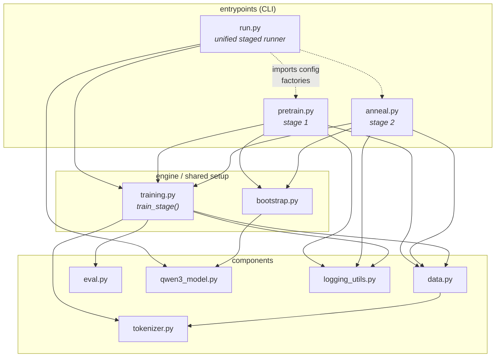
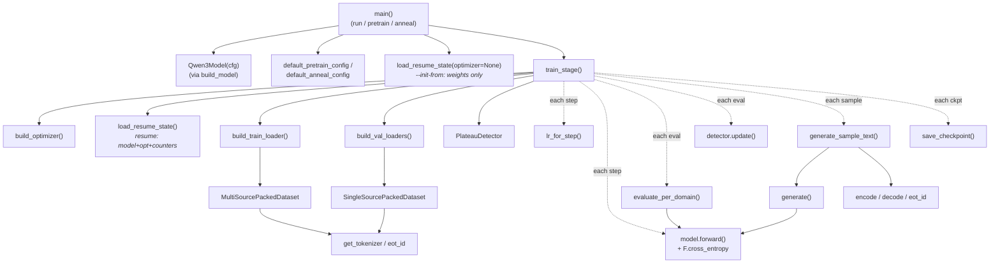
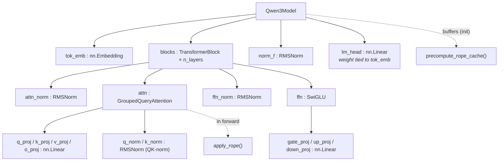

# v3 `src/` — code graph

Three views of `models/v3/src/`, zooming in from module wiring → runtime flow →
model internals. All diagrams are Mermaid (renders natively on GitHub/GitLab,
VS Code with the Mermaid extension, Obsidian, etc.).

---

## 1. Module dependency graph

Who imports whom. Three layers: thin CLI entrypoints on top, the
stage-agnostic engine in the middle, leaf components at the bottom. Note
`training.py` (the engine) never imports an entrypoint — the dependency arrows
only point *down*, which is what keeps `train_stage()` reusable by all three
launchers.

Leaves with no first-party imports (`eval.py`, `qwen3_model.py`,
`logging_utils.py`, `tokenizer.py`) depend only on torch / HF — they're the
safe-to-test-in-isolation parts.

---

## 2. Runtime call graph (a training stage)

What fires when you run `python run.py --stage pretrain` (or `pretrain.py` /
`anneal.py` — all three converge on `train_stage()`). Solid = direct call,
dashed = "used inside the loop each step/eval/ckpt".

The four dashed-loop nodes (`lr_for_step`, eval, sample, checkpoint) are gated
by `cfg.eval_every` / `sample_every` / `ckpt_every`. `save_checkpoint` is also
called twice outside the loop: once on graceful stop (resumable step ckpt) and
once on completion (`_final.pt`).

---

## 3. Model class composition (`qwen3_model.py`)

The only genuinely hierarchical part — `nn.Module` nesting. `▢` = submodule
attribute, dashed = stateless helper function used in `forward`.

Pre-norm residual flow per block: `x = x + attn(attn_norm(x)); x = x +
ffn(ffn_norm(x))`. RoPE (`cos/sin`) is precomputed once and threaded through
every block's attention.

---

### Regenerating these automatically

If you'd rather have these derived from the source (so they can't drift), the
usual tools are:

- **`pydeps src/`** → module-import graph (view 1) as SVG/dot.
- **`pyan3 src/*.py --uses --no-defaults --dot`** → call graph (view 2).
- **`code2flow src/`** → lightweight call graph, quick to run.

These emit dot/SVG rather than Markdown, so the Mermaid above is the
repo-friendly hand-curated equivalent.
